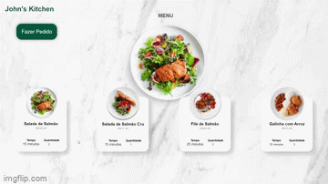

<h1 align="center">
  John's Kitchen 🍽️
</h1>

   
   
   
  </a>
   </a>
   
    

 

## 💻 Projeto

Site **Restaurante Delivery** simples feito em PHP, que tenta simular o usuário fazendo um pedido de um prato e colocando-o no carrinho. Esse projeto foi desenvolvido como tarefa para a disciplina de programação web na Etec, em que o desafio era desenvolver um site inteiro com HTML, CSS, JS e PHP apenas em um único arquivo.

 

### Demonstração

    

---

## ✨ Funcionalidades
- [x] Listagem de 4 pratos conténdo seus respectivos nome, imagem, preço, quantidade e tempo de preparo
- [x] Usuário pode selecionar 1 ou mais pratos do menu
- [x] Pratos selecionados pelo usuário ficam visualmente destacados na página
- [x] Imagem de fundo da página é alterada quando um prato é selecionado
- [x] Usuário ao clicar em finalizar pedido é aberto um modal contendo as informações citadas dos pratos selecionados + frete, juntamente com o preço a pagar e tempo de praparo totais calculados

---

## 📖 Aprendizado
- Passagem de dados de JavaScript para PHP através de Cookies;
- Conversão de JSON para variáveis PHP;
- Tratamento de objetos em JavaScript e arrays associativos em PHP;
- Abordagens diferentes de usar o loop for each tanto em JavaScript quanto em PHP;
- Criação de Cookies com JavaScript e obtenção de dados contidos em Cookies com PHP.

---

## 🛠️ Tecnologias
Esse projeto foi desenvolvido com as seguintes tecnologias

✔️ **[PHP](https://www.php.net/)**

✔️ **[JavaScript](https://developer.mozilla.org/pt-BR/docs/Web/JavaScript)**

✔️ **[CSS](https://developer.mozilla.org/pt-BR/docs-Web/CSS)**

✔️ **[HTML](https://developer.mozilla.org/pt-BR/docs-Web/HTML)**

---
## ⚙️ Deploy

O deploy desse projeto foi realizado através do **[Railway](https://railway.app/)**. Isso implica que você pode acessar o projeto funcionando acessando esse **[link](https://restaurante-johns-kitchen-production.up.railway.app/)**

---
## 🎨 Layout
No link abaixo você encontra o layout no [Figma](http://figma.com/) o qual eu usei como inspiração para criar esse projeto. Lembrando que você precisa ter uma conta Figma no para acessá-lo.

- [Layout](https://www.figma.com/file/dnmpZRvkoGsnx12TVuHeTs/Restaurant-Website-(Community)?node-id=0%3A1)

---

## 📝 Licença

Esse projeto está sob a licença MIT. Veja o arquivo [LICENSE](LICENSE) para mais detalhes.

---

   Feito com 💜 by John Petros 👋🏻

